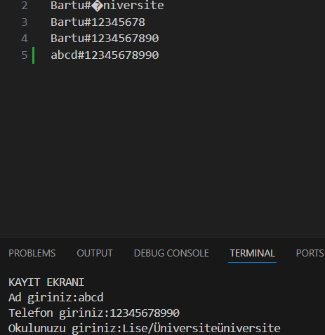
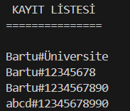
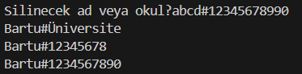

# Proje2 tanıtımı
<!-- README.md dosyasının içeriği -->

##  anamenü
 

 
Ana menüde projemin içinde geçenler yer alıyor
 
###Öğrenci ekleme yolumuz bu şekilde.
 

 
###Kayıtları listele yolumuz bu şekilde.
 

 
### Kayıtları düzenleme yolumuz bu şekilde.
 

 
abcd isimli girişin telefon numarasını değiştirdik...
 
###Öğrenci silme yolumuz bu şekilde.
 

 
Sildiğimiz hali ve Kalanlar burada böyle gözüküyor.
 

 
2.projem bu şekilde.
 